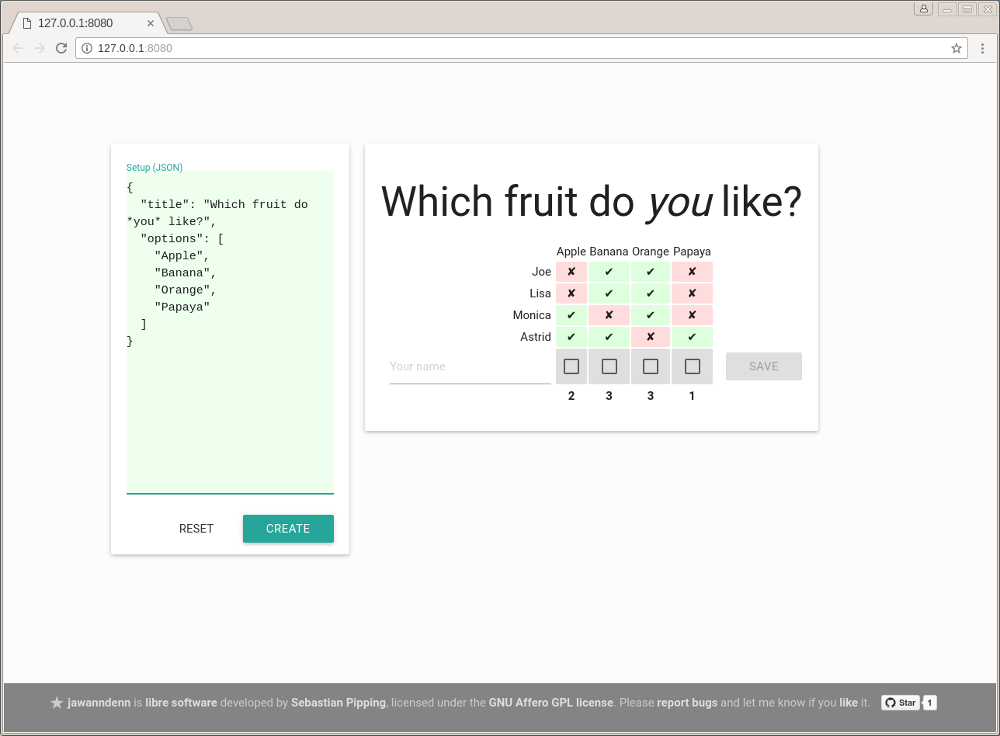

# What is jawanndenn?



*jawanndenn* is a simple web application to schedule meetings and run polls, a libre alternative to Doodle.
It is written in Python and JavaScript using
* [bottle](http://bottlepy.org/docs/dev/) with [Paste](http://pythonpaste.org/) for a default backend
* [jQuery](http://jquery.com/)
* [jQuery noty](http://ned.im/noty/#/about)
* [Materialize](http://materializecss.com/) Material Design CSS/JS

*jawanndenn* is [libre software](https://www.gnu.org/philosophy/free-sw.en.html)
developed by [Sebastian Pipping](https://blog.hartwork.org/).
The server code is licensed under the [GNU *Affero* GPL license](https://www.gnu.org/licenses/agpl.en.html) version 3 or later
whereas the client code is licensed under the [GNU GPL license](https://www.gnu.org/licenses/gpl.html) version 3 or later.

Please [report bugs](https://github.com/hartwork/jawanndenn/issues)
and let me know if you [like](mailto:sebastian@pipping.org) it.


# Installation

To install the latest release without cloning the Git repository:
```
# pip install jawanndenn
```

To install from a Git clone:
```
# python setup.py install --user
```


# Deployment with Apache mod_wsgi

To use *jawanndenn* with `mod_wsgi`, there is file `jawanndenn.wsgi`
For how to integrate `jawanndenn.wsgi` with the Apache configuration,
please check the
[the related documentation of bottle](https://bottlepy.org/docs/dev/deployment.html#apache-mod-wsgi).

Feel free to [file a support ticket](https://github.com/hartwork/jawanndenn/issues/new)
or [drop me a mail](mailto:sebastian@pipping.org), if you cannot get it to work.


# Command line usage

When installed, invocation is as simple as
```
# jawanndenn
```

During development, you may want to run *jawanndenn* from the Git clone using
```
# PYTHONPATH=. python jawanndenn/main.py --debug
```

Currently supported arguments are:
```
# jawanndenn --help
usage: jawanndenn [-h] [--debug] [--host HOST] [--port PORT]
                  [--server BACKEND] [--max-polls COUNT]
                  [--max-votes-per-poll COUNT]

optional arguments:
  -h, --help            show this help message and exit
  --debug               Enable debug mode (default: disabled)
  --host HOST           Hostname or IP address to listen at (default:
                        127.0.0.1)
  --port PORT           Port to listen at (default: 8080)
  --server BACKEND      bottle backend to use (default: paste); as of this
                        writing bottle supports: auto, bjoern, cgi, cherrypy,
                        diesel, eventlet, fapws3, flup, gae, gevent, gunicorn,
                        meinheld, rocket, tornado, twisted, waitress, wsgiref.
                        For the most current list, please check the
                        documentation of bottle.

limit configuration:
  --max-polls COUNT     Maximum number of polls total (default: 100)
  --max-votes-per-poll COUNT
                        Maximum number of votes per poll (default: 40)
```


# Goals

* Libre software to host yourself, other than Doodle
* More simple, sexy and fun than
  * [Pleft](https://github.com/sander/pleft)
  * [Framadata](https://framadate.org/)
    ([Sources](https://git.framasoft.org/framasoft/framadate), ex. OpenSondage, ex. STUdS)
  * [Dudle](https://dudle.inf.tu-dresden.de/)
  * [Nuages](https://nuages.domainepublic.net/)
  * [RDVz](https://sourceforge.net/projects/rdvz/)
  * ([Drupal Date picker formatter](http://alternativeto.net/software/date-picker-formatter-dudel-for-drupal/?license=opensource))
* Keep things simple, usable, maintainable
* Support invocation from the command line
* Have security in mind

Please check out the
[list of upcoming features](https://github.com/hartwork/jawanndenn/issues/created_by/hartwork).


# Non-goals

* Use of heavy frameworks: building blocks only
* Read availability from calendars
